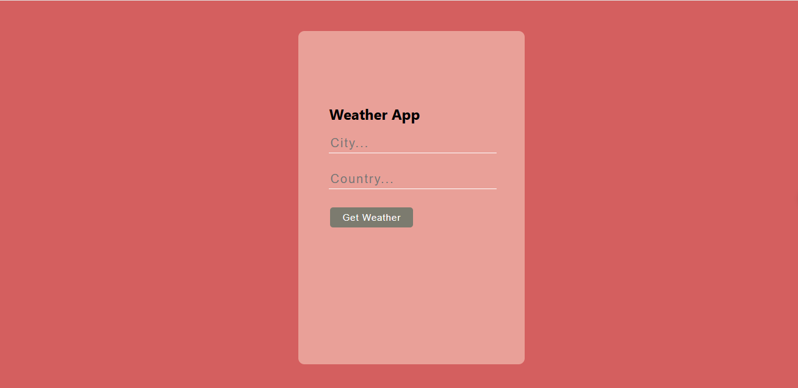
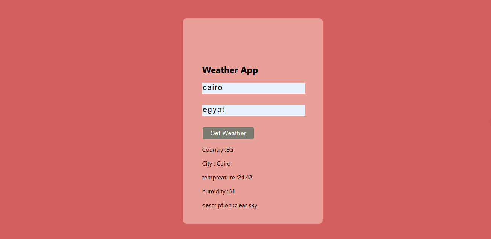

# weather-app-api_React-Project_Class-Component

This is a simple weather application built with ReactJs [class-component]. It allows users to get a temperature, humidity, and description for any county just enter the Country name and City name then the app will connect with API and fetch the data. The application uses class components for state management and rendering.
## Table of contents

- [Overview](#overview)
- [Features](#Features)
- [Components](#Components)
  - [App](#App)
  - [Form](#Form)
  - [CourseForm](#CourseForm)
- [Installation](#Installation)
- [Usage](#Usage)
- [Links](#Links)
- [Screenshot](#Screenshot)
- [What I learned](#what-i-learned)
- [Continued development](#continued-development)
- [Author](#author)
- [Acknowledgments](#Acknowledgments)


## overview
It's a simple weather app that helps users to get a temperature, humidity, and description of any county by enter the Country name and City name. It serves as an excellent example for those looking to understand and implement React.js concepts in their projects.

## Features
- it helps you to know tempreature, humidity and description of any county by enter the name of Country and City

## Components

### App

The main component that holds the state and renders the Weather and Form components.

### Weather

Displays the output of user entries.

### Form

Contains a form to enter country name and city name.


## Installation
To get started with this project, follow these steps:

you can clone the project or download it as Zip file.
1. Clone the repository:
   ```bash
   git clone https://github.com/olahasan/weather-app-api_React-Project_Class-Component

2. Navigate to the project directory:
   cd <project-directory>

3. Install the required dependencies:
   npm install   


## Usage
To run the application, use the following command:

npm start


## Links

If you want to open the link in a new tab, you can:

- Press **Ctrl** (or **Cmd** on Mac) while clicking the link.
- Right-click the link and select **Open link in new tab**.

Otherwise, all links will open in the same tab.


- Solution URL: [here](https://github.com/olahasan/weather-app-api_React-Project_Class-Component)

- Live Site URL: [here](https://weather-app-classes.surge.sh/)

 ## Screenshot
 




## what-i-learned
Through this project:
1-I learned  how to create react app and treat with calss component.
2-how to contact with API
3-how to deploy it on Surge.sh

## Continued Development
In the future, I plan to:
- learn reactJs Hooks and redux.

### Author

GitHub - @olahasan

### Acknowledgments

I would like to thank the **[unique coderz academy](https://www.youtube.com/@UniqueCoderzAcademy)** for providing this challenge and to the community for their support.

